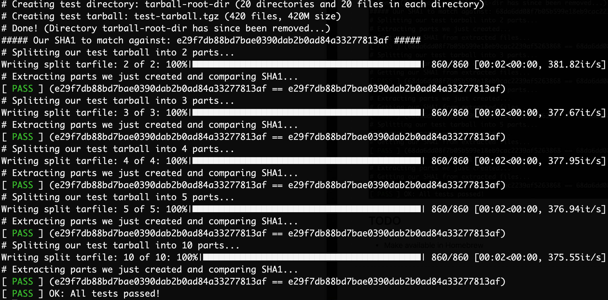

# Tarsplit

A utility to split tarballs into smaller pieces along file boundaries.

This is useful for gigantic tarballs that need to need to be split up so that they can fit on USB sticks, more reasonably sized Docker layers, or whatever.


## Installation

### Manually

```python3 -m pip install git+https://github.com/dmuth/tarsplit.git```


## Usage

`tarsplit [ --dry-run ] tarball num_files`

Example run:


## FAQ

### How does it work?

This script is written in Python, and uses the <a href="https://docs.python.org/3/library/tarfile.html">tarfile module</a> 
to read and write tarfiles.  This has the advantage of not having to extract the entire tarball,
unlike the previous version of this app which was written in Bash Shell Script.


### Why?

While working on <a href="https://github.com/dmuth/splunk-lab">Splunk Lab</a>, I kept running into
an issue where a particular layer in the Docker image was a Gigabyte in size.  This was a challenge because
there was a number of wallclock seconds wasted when processing the large layer after a push or pull.  If 
only there was a way to split that layer up into multiple smaller layers, which Docker would then 
transfer in parallel...

While investigating, the culprit turned out to be a very large tarball.  I wanted a way to split that
tarball into multiple smaller tarballs, each of which contained a portion of the filesystem.  Then, I could
build multiple Docker containers, each with a portion of the original tarball's files, with each container
inheriting the previous container.  This would leverage one of the things Docker is good at: layered filesystems.


### This is slow on large files.  Ever hear of multithreading?

Yeah, I tried that after release 1.0.  It turns out that even when using every trick I knew that
a multithreaded approach consisting of one thread per chunk to be written was *slower* than just
doing everything in a single thread.  I observed this on a 10-core machine with an SSD, so I'm
just gonna go ahead and point the finger at the GIL and remind myself that threading in Python is cursed.


### What about asyncio?

I used asyncio successfully for another project and haven't ruled it out.  I am however skeptical because of the
very high level of disk usage.  Async I/O would be more approiate for dozens/hundreds of writers hitting
the disk occasionally, and this is not the case here.


## Development

### Support scripts

- `bin/create-test-tarball.sh` - Create a test tarball with directories and files inside.
- `sha1-from-directory.sh` - Get a recursive list of all files in a directory, sort it, SHA1 each file, then concatenate all SHA1s and SHA1 that!
- `sha1-from-tarball.sh` - Extract a tarball, then do the same thing to the contents as `sha1-from-directory.sh`.


### Tests

Tests can be run with `tests.sh`.  A successful run looks something like this:




